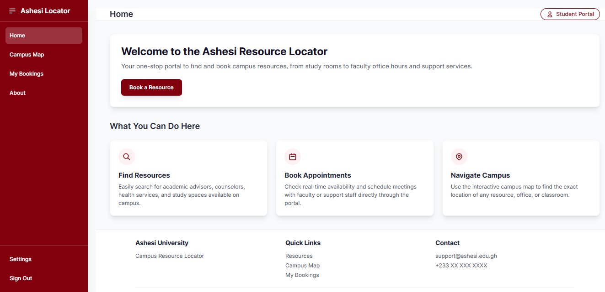

<h1 align="center">Ashesi Campus Resource Locator (acrl)</h1>

<p align="center">
  A web application for locating and accessing campus resources on the Ashesi University campus.<br>
  Designed for Web Technologies 213.
  <br />
  <a href="#features"><strong>Explore the Features »</strong></a>
  <br /><br />
  
  
  
</p>


## Table of Contents

1. [Overview](#overview)  
2. [Features](#features)  
   - [General Users](#general-users-students-faculty-visitors)  
   - [Admin Users](#admin-users)  
3. [Core Web Pages](#core-web-pages)  
4. [Database Design](#database-design)  
5. [Tech Stack](#tech-stack)  
6. [Preview](#preview--incoming)  
7. [Learning Objectives](#learning-objectives)  
8. [Installation Guide](#installation-guide)  
9. [Contributors](#contributors)  
10. [License](#license)  
11. [Submission Links](#submission-links)


## Overview

The **Ashesi Campus Resource Locator (acrl)** is an interactive web-based system that helps students, faculty, staff, and visitors find and explore campus facilities.  
The system centralizes resource information such as classrooms, labs, seminar rooms, and study spaces, and displays them on a fully interactive **Mapbox-powered map**.

The application supports:
- Admin tagging of campus hotspots  
- Searching and filtering of resources  
- Booking and availability management  
- Secure login for authenticated users  
- A responsive front-end interface  

This project provided hands-on experience with mapping APIs, PHP–MySQL integration, dynamic data visualization, and full-stack system design.


## Features

### General Users (Students, Faculty, Visitors)
- View all campus resource hotspots on an interactive map  
- Filter resources by type or capacity  
- Click and explore details for each resource  
- Log in to access booking features  
- Reserve available time slots for rooms  

### Admin Users
- Add new resources directly by clicking on the map  
- jQuery-powered slide-in form for entering resource details  
- Manage capacity, type, and location for each hotspot  
- Edit availability using modal-based interfaces  
- Update, create, and manage time sessions  


## Core Web Pages

| Page | Description |
|------|-------------|
| **Home Page** | Introduction to acrl and navigation to main pages |
| **Login / Logout** | Authentication for general users and admins |
| **Resource Locator Page** | Main Mapbox interface with search and filters |
| **Booking Page** | Allows authenticated users to reserve a resource session |
| **Admin: Resource Allocator** | Map-click tagging using a slide-in form |
| **Admin: Available Sessions** | Modal editor for availability and time slot management |

---

## Database Design

| Table | Fields |
|-------|--------|
| **users** | user_id, name, ashesi_email, password_hash, is_active, created_at, role |
| **resources** | resource_id, type_id, name, capacity, description, longitude, latitude, is_bookable |
| **bookings** | booking_id, user_id, resource_id, start_time, end_time, purpose, status |
| **resource_availability** | availability_id, resource_id, day_of_week, start_time, end_time, created_at |
| **resource_types** | type_id, type_name |

This schema supports dynamic resource management, map integration, and booking functionality.


## Tech Stack

<p align="left">
  
</p>

| Technology | Purpose |
|-----------|---------|
| **HTML5 / CSS3 / TailwindCSS** | Frontend structure and styling |
| **JavaScript & jQuery** | Client-side logic and interactive UI |
| **PHP** | Backend logic, routing, and database operations |
| **MySQL** | Persistent storage of resources, users, and sessions |
| **Mapbox GL JS** | Interactive campus map and geolocation |
| **Git & GitHub** | Version control and team collaboration |


## Preview
<p align="center">
  
</p>


## Learning Objectives

Through building this project, we are gaining experience in:
- Managing interactive mapping interfaces  
- Designing and structuring a full-stack PHP application  
- Performing CRUD operations with MySQL  
- Creating dynamic UI components such as modals and slide-in forms  
- Handling authentication and secure login flows  
- Organizing a multi-file project with clean architecture  
- Integrating frontend, backend, and mapping APIs cohesively  


## Installation Guide

1. **Clone the repository**
   ```bash
   git clone https://github.com/AshesiWebTech2025/ResourceLocator.git

2. **Set up the database**
    - Open phpMyAdmin
    - Create a database (e.g., acrl_db)
    - Import the .sql file in the /database directory

3. Configure database connection
    - Update your credentials in db_config.php:
    ```bash
    $conn = mysqli_connect("localhost", "root", "", "acrl_db");

4. Run the project
    - Start Apache and MySQL in XAMPP
    - Visit:
    ```bash
    http://localhost/ResourceLocator
        ```


## Contributors

<table>
  <tr>
    <td align="center">
      <a href="https://github.com/malimba">
        
        <br />
        <b>George</b>
        <br />
        <sub>malimba</sub>
      </a>
    </td>
    <td align="center">
      <a href="https://github.com/trpbtl">
        
        <br />
        <b>Eyram-Makafui</b>
        <br />
        <sub>trpbtl</sub>
      </a>
    </td>
    <td align="center">
      <a href="https://github.com/marzafiee">
        
        <br />
        <b>Inez</b>
        <br />
        <sub>marzafiee</sub>
      </a>
    </td>
    <td align="center">
      <a href="https://github.com/sirahknotfound">
        
        <br />
        <b>Kharis</b>
        <br />
        <sub>sirahknotfound</sub>
      </a>
    </td>
  </tr>
</table>


## License
- Distributed under the MIT License.
- See the LICENSE file for more information.

## Submission Links
- GitHub Repository: https://github.com/AshesiWebTech2025/ResourceLocator 