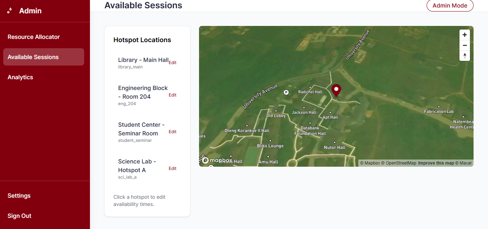
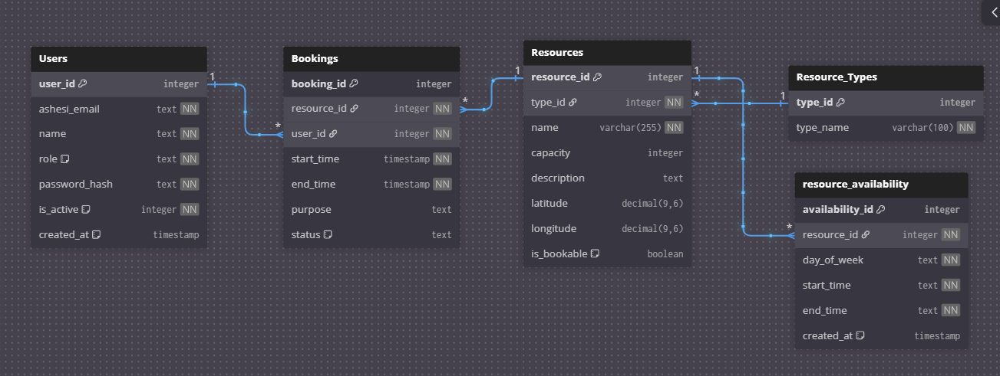

# Ashesi Campus Resource Locator (ACRL)

A comprehensive web application for locating, viewing, and booking campus resources at Ashesi University. Built as part of the Web Technologies 213 course.

---

## Table of Contents

1. [Overview](#overview)
2. [Key Features](#key-features)
3. [System Architecture](#system-architecture)
4. [Project Structure](#project-structure)
5. [Technology Stack](#technology-stack)
6. [Database Schema](#database-schema)
7. [Installation Guide](#installation-guide)
8. [Server Deployment](#server-deployment)
9. [Usage Guide](#usage-guide)
10. [API Endpoints](#api-endpoints)
11. [Screenshots](#screenshots)
12. [Contributors](#contributors)
13. [License](#license)

---

## Overview

The **Ashesi Campus Resource Locator (ACRL)** is an interactive web-based system designed to help students, faculty, staff, and visitors discover and book campus facilities. The platform centralizes information about classrooms, labs, seminar rooms, study spaces, and other campus resources, displaying them on an interactive Mapbox-powered map.

### Problem Statement

Students and staff often struggle to find available spaces for meetings, study sessions, or events. Information about room availability, capacity, and location is scattered across different systems, leading to double bookings and inefficient resource utilization.

### Solution

ACRL provides a unified platform where users can:
- Visualize all campus resources on an interactive map
- Check real-time availability of rooms and spaces
- Make bookings with automatic conflict detection
- Manage resource availability through an admin interface

---

## Key Features

### For General Users (Students, Faculty, Visitors)

| Feature | Description |
|---------|-------------|
| Interactive Campus Map | View all resources on a Mapbox-powered map with zoom and navigation |
| Resource Search | Filter resources by type, capacity, or availability |
| Resource Details | View detailed information including capacity, description, and location |
| Booking System | Reserve available time slots for rooms and spaces |
| Booking Management | View, manage, and cancel existing bookings |
| Availability Preview | See available and booked time slots before booking |

### For Administrators

| Feature | Description |
|---------|-------------|
| Resource Allocation | Add new resources by clicking on the map |
| Resource Management | Edit resource details, capacity, and type |
| Availability Configuration | Set weekly availability schedules for each resource |
| Time Slot Management | Define when resources can be booked |
| Resource Type Management | Create and manage resource categories |

### Booking Validation System

The application includes intelligent booking validation:

- **Time Slot Validation:** Bookings must fall within defined availability windows (if configured)
- **Conflict Detection:** Prevents double bookings automatically
- **Flexible Resources:** Resources without defined time slots are freely bookable
- **User-Friendly Messages:** Clear feedback on why a booking may be rejected

---

## System Architecture

```
┌─────────────────────────────────────────────────────────────┐
│                      CLIENT BROWSER                          │
│  ┌─────────────┐  ┌─────────────┐  ┌─────────────────────┐  │
│  │   HTML/CSS  │  │ JavaScript  │  │    Mapbox GL JS     │  │
│  │  TailwindCSS│  │   jQuery    │  │  Interactive Maps   │  │
│  └─────────────┘  └─────────────┘  └─────────────────────┘  │
└─────────────────────────────────────────────────────────────┘
                              │
                              ▼
┌─────────────────────────────────────────────────────────────┐
│                      PHP BACKEND                             │
│  ┌─────────────┐  ┌─────────────┐  ┌─────────────────────┐  │
│  │   Routing   │  │   Session   │  │    API Handlers     │  │
│  │   & Auth    │  │  Management │  │   (CRUD Operations) │  │
│  └─────────────┘  └─────────────┘  └─────────────────────┘  │
└─────────────────────────────────────────────────────────────┘
                              │
                              ▼
┌─────────────────────────────────────────────────────────────┐
│                    SQLite DATABASE                           │
│  ┌─────────┐ ┌──────────┐ ┌──────────┐ ┌──────────────────┐ │
│  │  Users  │ │ Resources│ │ Bookings │ │ Resource Avail.  │ │
│  └─────────┘ └──────────┘ └──────────┘ └──────────────────┘ │
└─────────────────────────────────────────────────────────────┘
```

---

## Project Structure

```
ResourceLocator/
├── backend/                    # PHP backend files
│   ├── dbConnector.php         # Database connection and core functions
│   ├── loginSignupPreprocessor.php  # Authentication handler
│   ├── create_booking.php      # Booking creation endpoint
│   ├── cancel_booking.php      # Booking cancellation endpoint
│   ├── check_availability.php  # Availability check API
│   ├── fetch_resources.php     # Resource listing API
│   ├── fetch_bookings.php      # Booking retrieval API
│   ├── resourceAllocator.php   # Resource creation handler
│   ├── addType.php             # Resource type creation
│   └── getTypes.php            # Resource type listing
│
├── frontend/                   # Frontend files
│   ├── login_signup.php        # Authentication page
│   ├── home.php                # Main dashboard
│   ├── resourceLocator.php     # Interactive map view
│   ├── bookings.php            # User bookings management
│   ├── resourceAllocator.php   # Admin: Resource allocation
│   ├── available_sessions.php  # Admin: Availability management
│   ├── about.php               # About/team page
│   ├── software_architecture.php  # Architecture documentation
│   ├── pageflow.php            # Page flow documentation
│   ├── css/
│   │   └── style.css           # Custom styles
│   ├── js/
│   │   ├── main.js             # Core JavaScript utilities
│   │   ├── map.js              # Mapbox integration
│   │   ├── resourceAllocator.js # Resource allocation logic
│   │   ├── available_sessions.js # Availability management
│   │   └── tailwindConfig.js   # Tailwind configuration
│   └── images/                 # Image assets
│
├── setup/                      # Database and setup files
│   ├── mockDatabase.db         # SQLite database file
│   └── *.py                    # Python setup scripts
│
├── README.md                   # Project documentation
├── SERVER_SETUP.md             # Deployment guide
└── LICENSE                     # MIT License
```

---

## Technology Stack

### Frontend
| Technology | Purpose |
|------------|---------|
| HTML5 | Semantic page structure |
| TailwindCSS | Utility-first CSS framework |
| JavaScript (ES6+) | Client-side interactivity |
| jQuery | DOM manipulation and AJAX |
| Mapbox GL JS | Interactive mapping |

### Backend
| Technology | Purpose |
|------------|---------|
| PHP 7.4+ | Server-side logic |
| SQLite3 | Database management |
| Session Management | User authentication state |

### Development Tools
| Tool | Purpose |
|------|---------|
| Git | Version control |
| XAMPP | Local development server |
| VS Code / Cursor | Code editor |

---

## Database Schema

### Entity Relationship Diagram

```
┌──────────────┐     ┌──────────────────┐     ┌──────────────┐
│    Users     │     │    Resources     │     │Resource_Types│
├──────────────┤     ├──────────────────┤     ├──────────────┤
│ user_id (PK) │     │ resource_id (PK) │────▶│ type_id (PK) │
│ ashesi_email │     │ type_id (FK)     │     │ type_name    │
│ first_name   │     │ name             │     └──────────────┘
│ last_name    │     │ capacity         │
│ role         │     │ description      │
│ password_hash│     │ latitude         │
│ is_active    │     │ longitude        │
│ created_at   │     │ is_bookable      │
└──────┬───────┘     └────────┬─────────┘
       │                      │
       │    ┌─────────────────┴───────────────────┐
       │    │                                     │
       ▼    ▼                                     ▼
┌──────────────────┐                    ┌─────────────────────┐
│     Bookings     │                    │Resource_Availability│
├──────────────────┤                    ├─────────────────────┤
│ booking_id (PK)  │                    │ availability_id (PK)│
│ resource_id (FK) │                    │ resource_id (FK)    │
│ user_id (FK)     │                    │ day_of_week         │
│ start_time       │                    │ start_time          │
│ end_time         │                    │ end_time            │
│ purpose          │                    │ created_at          │
│ status           │                    └─────────────────────┘
└──────────────────┘
```

### Table Descriptions

| Table | Description |
|-------|-------------|
| **Users** | Stores user accounts with authentication credentials and roles |
| **Resources** | Campus facilities with location coordinates and capacity |
| **Resource_Types** | Categories for organizing resources (Classroom, Lab, etc.) |
| **Bookings** | User reservations with time slots and status tracking |
| **Resource_Availability** | Weekly availability schedules for each resource |

---

## Installation Guide

### Prerequisites

- XAMPP (Apache, PHP 7.4+, SQLite support)
- Git
- Web browser (Chrome, Firefox, Safari, or Edge)

### Local Development Setup

1. **Clone the Repository**
   ```bash
   cd /path/to/xampp/htdocs
   git clone https://github.com/AshesiWebTech2025/ResourceLocator.git
   cd ResourceLocator
   ```

2. **Verify PHP SQLite Extension**
   
   Ensure SQLite3 is enabled in your PHP installation:
   ```bash
   php -m | grep sqlite
   ```

3. **Set Database Permissions**
   ```bash
   chmod 755 setup/
   chmod 666 setup/mockDatabase.db
   ```

4. **Start XAMPP Services**
   - Launch XAMPP Control Panel
   - Start Apache

5. **Access the Application**
   
   Open your browser and navigate to:
   ```
   http://localhost/ResourceLocator/frontend/login_signup.php
   ```

### Default Test Accounts

| Role | Email | Password |
|------|-------|----------|
| Student | test@ashesi.edu.gh | password123 |
| Admin | admin@ashesi.edu.gh | admin123 |

---

## Server Deployment

For detailed instructions on deploying to InfinityFree or similar hosting platforms, see:

**[SERVER_SETUP.md](SERVER_SETUP.md)**

---

## Usage Guide

### For Students/Faculty

1. **Login:** Access the system with your Ashesi credentials
2. **Browse Resources:** Use the Campus Map to explore available facilities
3. **Make a Booking:**
   - Click "Book a Resource" from the home page or bookings page
   - Select a resource from the dropdown
   - Choose a date and check available time slots
   - Enter start time, end time, and purpose
   - Submit the booking
4. **Manage Bookings:** View and cancel bookings from "My Bookings"

### For Administrators

1. **Allocate Resources:**
   - Navigate to Resource Allocator
   - Click on the map to set location
   - Fill in resource details
   - Save the resource
2. **Configure Availability:**
   - Go to Available Sessions
   - Select a resource
   - Add time slots for each day
   - Save the availability schedule

---

## API Endpoints

### Resource Management

| Endpoint | Method | Description |
|----------|--------|-------------|
| `backend/fetch_resources.php` | GET | List all resources |
| `backend/resourceAllocator.php` | POST | Create new resource |
| `backend/getTypes.php` | GET | List resource types |
| `backend/addType.php` | POST | Create resource type |

### Booking Management

| Endpoint | Method | Description |
|----------|--------|-------------|
| `backend/create_booking.php` | POST | Create new booking |
| `backend/cancel_booking.php` | POST | Cancel existing booking |
| `backend/fetch_bookings.php` | GET | List user bookings |
| `backend/check_availability.php` | GET | Check resource availability |

### Availability Management

| Endpoint | Method | Description |
|----------|--------|-------------|
| `frontend/available_sessions.php?action=getAvailabilitySlots` | GET | Get time slots |
| `frontend/available_sessions.php?action=updateSlots` | POST | Update time slots |

---

## Screenshots

### Home Page


### Available Sessions Management


### System Architecture


---

## Contributors

| Name | GitHub | Role |
|------|--------|------|
| George Malimba | [@malimba](https://github.com/malimba) | Backend Development, Database Design |
| Eyram-Makafui Awoye | [@trpbtl](https://github.com/trpbtl) | Frontend Development, UI/UX |
| Inez Marzafi | [@marzafiee](https://github.com/marzafiee) | Frontend Development, Documentation |
| Kharis | [@sirahknotfound](https://github.com/sirahknotfound) | Integration, Testing |

---

## License

This project is licensed under the MIT License. See the [LICENSE](LICENSE) file for details.

---

## Acknowledgments

- Ashesi University Web Technologies 213 Course
- Mapbox for the interactive mapping platform
- TailwindCSS for the utility-first CSS framework

---

## Repository

GitHub: [https://github.com/AshesiWebTech2025/ResourceLocator](https://github.com/AshesiWebTech2025/ResourceLocator)

---

*Ashesi Campus Resource Locator - Web Technologies 213*  
*Ashesi University, 2025*
